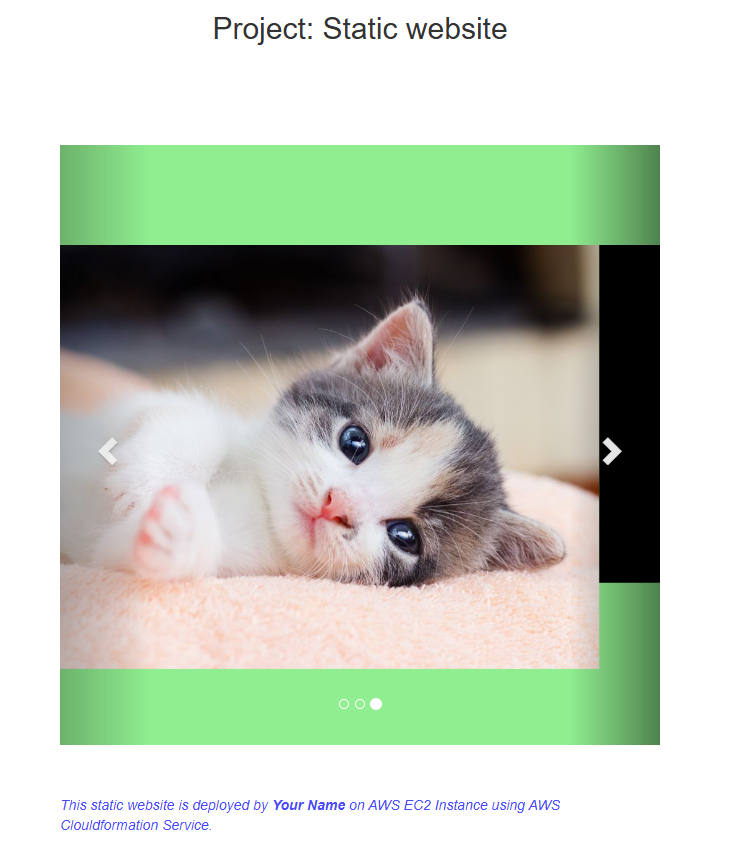

# Project-101 : Static Website on Amazon Linux 2023 EC2 using CloudFormation

## Description
This is a static website application deployed with Apache Web Server on AWS Elastic Compute Cloud (EC2) Instance using AWS Cloudformation Service. 
This repository contains an __AWS CloudFormation template__ to automate the deployment of a __static website__ on an __Amazon Linux 2023 EC2 instance__. The template provisions an EC2 instance with Apache, downloads static content (images and an HTML file) from your Github repository, and serves them as a static website.

## Features
- __Automated Setup__: Launch an EC2 instance running __Amazon Linux 2023__ with __Apache HTTP server__ configured.

- __Static Website__: Automatically downloads static files (images and HTML) from a GitHub repository and serves them.

- __Security__: The template creates a security group that allows __SSH (port 22)__ and __HTTP (port 80)__ traffic.

- __Customizable__: Easily modify the `UserData` section to update or change the content being served by the instance.

- __Outputs the Website URL__: After stack creation, the public DNS URL of the EC2 instance hosting the website is displayed.

## CloudFormation Template Overview
This _CloudFormation_ template performs the following tasks:

- Creates an EC2 instance using the latest Amazon Linux 2023 AMI.

- Installs Apache HTTP server and configures it to serve static files.

- Downloads static content (images and HTML) from a GitHub repository.

- Restarts Apache to apply changes.

- Outputs the EC2 instance's public URL, which can be accessed to view the static website.


## Prerequisites
Before using this template, ensure you have the following:

- __AWS Account__: You need an AWS account to deploy resources.

- __SSH Key Pair__: Create a key pair in AWS EC2 and provide the key name in the template `(KeyName: mesud-course)`.

- __GitHub Repository__: Ensure the GitHub repository with the static website files (`cat0.jpg`, `cat1.jpg`, `cat2.jpg`, `and index.html`) is publicly accessible.

- __AWS CLI/Console__: You can use either the AWS Management Console or AWS CLI to deploy the CloudFormation stack.
  
## Project Skeleton 

```
101-kittens-carousel-static-website-ec2 (folder)
|
|----readme.md         # Given to the students (Definition of the project)          
|----cfn-template.yml  # To be delivered by students (Cloudformation template)
|----static-web
        |----index.html  # Given to the students (HTML file)
        |----cat0.jpg    # Given to the students (image file)
        |----cat1.jpg    # Given to the students (image file)
        |----cat2.jpg    # Given to the students (image file)
```

## Usage
## A- Deploy via AWS Console
Navigate to the __AWS CloudFormation__ section of the AWS Management Console.

 1- Choose __Create stack__ and select __Upload a template file__.

 2- Upload the `cfn-website-template.yaml` file from this repository.

 3- Enter the required parameters and options (e.g., KeyPair name).

 4- Click __Create Stack__.

 5- Wait for the stack to be created, and AWS will automatically launch the EC2 instance.
 
## B- Deploy via AWS CLI
If you prefer to use the AWS CLI, you can deploy the stack with the following command:
```
aws cloudformation create-stack --stack-name StaticWebsiteStack --template-body file://cfn-website-template.yaml
```

## Expected Outcome




## Notes

- The security group allows __SSH (port 22)__ and __HTTP (port 80)__ traffic. You can modify these settings under the `MySecGroupNew` resource.

## Resources

- [AWS Cloudformation User Guide](https://docs.aws.amazon.com/AWSCloudFormation/latest/UserGuide/Welcome.html)
- [Launching the latest AL2023 AMI using AWS CloudFormation](https://docs.aws.amazon.com/linux/al2023/ug/ec2.html#launch-from-cloudformation)
